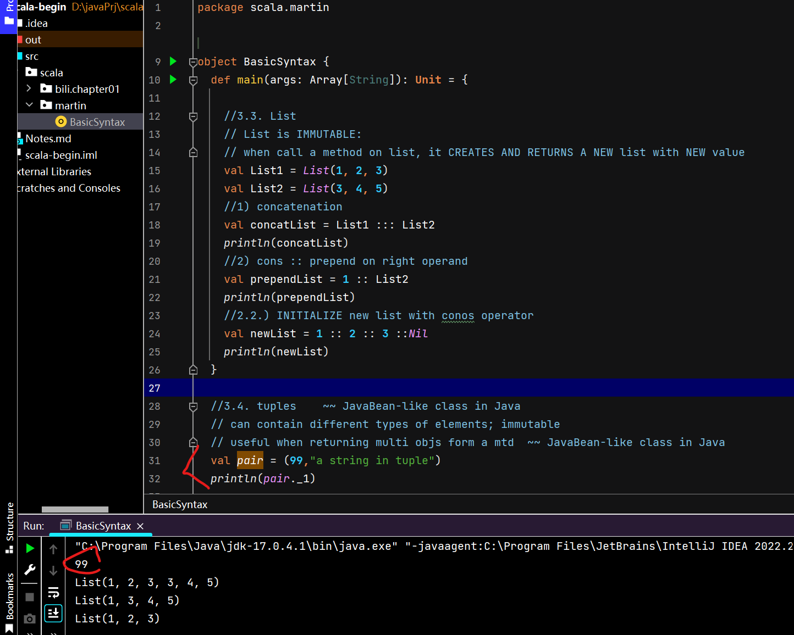
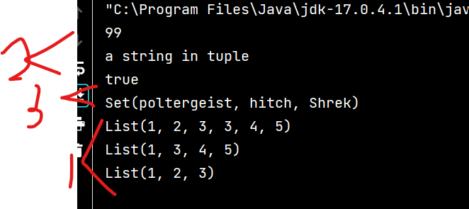
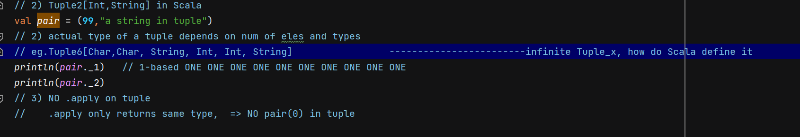

# Programimng in Scala
###### by Martin Ordersky

# C1. Intro
scalable language </br>
strength: building large sys and frameworks of **reusable** components </br>

Statically typed language</br>
- **OODP**
- **Functional**

Associative maps </br>
"one size fits all" philosophy  -- Scala provides ""fine-grained" control </br>
map: **library abstractions**  ~~language syntax~~ </br>

adaptive & extensible </br>
new types as built-in types </br>

### 1.1. Concurrency
- java concurrency library
- Akka (actors - message passing architectures)

#### Actors
concurrency abstractions on top of threads</br>
communicate by sending messages</br>
basic operations: </br>
- message send  </br>
  `recipient ! msg` </br>
  asynchronous: queue messages in `mailbox` (`receive` block) for each actor
- receive


### 1.2. Scalability
**function value is an object**</br>
function types are classes that can be **inherited** by subclasses</br>

#### OODP
- value = object </br>
- operation = method call</br>
- trait  = interface (Java) + method implementation + fields</br>
    - **mixin composition**:</br>
      objects take the **members of a class** and adds the members of a number of traits to them </br>
      diff aspects of classes -- encapsulated in different traits</br>
      like multiple inheritance</br>
    - pluggable, can add functionality to unspecified **super**class

#### functional
1. first-class value</br>
   1.1. pass functions as arguments & return as results & store in variables</br>
   1.2. define a func insides another func</br>
   1.3. can define func without name
2. immutable data & no side effect</br>
   2.1. map input values to output values  ~~change data in place~~</br>
   2.2. referentially transparent:</br>
   2.2.1. all occurences of one char are replaced by the other
   2.2.2. no side effect: communicate with their env ONLY by taking arguments and returning results </br>
   </br>
   Scala try to avoid imperative constructs
> imperative style
> mutable data & side effects


### 1.3. Why
1. compatible: </br>
   Scala programs compile on JVM bytecodes.Scala can call Java methods & reuse Java types
2. concise
3. high-level</br>
   3.1. can raise the level of abstraction in the interfaces you design and use</br>
   eg. `val nameHasUpperCase = name.exists(_.isUpper)`</br>
   To String:
    - Java: low-level entities; step through char by char in a LOOP
    - Scala: higher-level sequences of chars, queried with PREDICATES.
        - `.isUpper` a **functional literal** </br>

   3.2.high-level **reasoning principles**</br>
   functions are referentially transparent - func is characterized only by result.</br>
   eliminate aliasing problems encountered in imperative programming.

4. statically typed </br>
   static type sys classifies variables and expressions accord to **kinds of values** they hold and compute</br>
- to parameterize types with **GENERICS**,
- to combine types using **intersections**,
- and hide detials of types using **abstract types** </br>

  </br>help to compose own types</br>


# C2. first step
| scala                                                   | java | notes                                                                                                                                                                                        |
|---------------------------------------------------------|------|----------------------------------------------------------------------------------------------------------------------------------------------------------------------------------------------|
| val                                                     |const type| cannot change                                                                                                                                                                                |
| var                                                     |type| can reassign and change                                                                                                                                                                      |
| def funcName (arg1: type, arg2:type) : resultType = { } |
| :quit / :q                                              | | exit interpreter                                                                                                                                                                             |
| args                                                    | | command line arguments, a Scala array                                                                                                                                                        |
| args(0)                                                 | args[0] | access an element in array by index in parentheses()                                                                                                                                         |
| args.foreach((arg: String) => println(arg))             | | `StringName.foreach( arg => ) ` functioanl literal                                                                                                                                           |
| for(arg <- args) pringln(arg) | | `(arg <- args)`  `arg` is **val**  ~~var~~ ; a NEW arg val is created and initialized to the element value for each element of the args array, </br> then the body of `for` will be executed |
|

### Syntax of functional literal:
(x: Int, y: Int)              =>          x + y
func parameters in ()    right arrow   funcion body


## C3. next step
### 3.1. Parameterize array
```
val newStrings : Array[String] = new Array[String](3)
newStrings (0) = "Hello"
``` 

`new` : instantiate objects/class instances</br>
parameterize: configure an instance when **created** with **value and types** </br></br>

- `val newString` </br>
when define a variable with `val`</br>
it CANNOT be reassigned, ALWAYS POINT TO the same Array[String] instance
- `Array[String](3)` object </br>
elements can be changed (the array is mutable)</br>
lengh of array is FIXED


### 3.2. method simplification with ONLY ONE parameter
ex1. ` for (i <- 0 to 2)`  ====   `(0) .to(2)`</br>    
>for(i <- x to y )  y is contained !!!! included!!!!! </br>

ex2. When call index of array:</br>
```
newString(i) === newString.apply(i)
newString(0) = "Hello"    ===  newString.update(0,"Hello") 
```

### 3.3. list
- left operand </br>
`:+`   time ~ size of list
- right operand: end with : , invoke on right hand object</br>
`::`  constant time; </br>
better way to append: PREPEND then `reverse`

### 3.4. tuple

### 3.5. sets & maps
| functional | imperative | explain                                            |
|-----------|------------|----------------------------------------------------|
| immutable | mutable    | Scala has collections lib to differentiate between |
| lists     | -          ||
| -         | arrays     ||

### trait
~ Java interface </br>
two subtraits
- mutable traits
- immutable traits

### 3.5. functioanl programming
1. avoid var - more likely to be mutable
```
while(i<args.length){
    println(args(i))
    i += 1
}
    
for (arg <- args) 
    println(args)
    
args.foreach(println())
```
2. return Unit - likely mutable
3. pass args for printing, just returns formatted string  ~~print()~~ </br>
`def formatArgs(args : Array[String]) = args.mkString("\n")`</br>
---`anyIterableCollection.mkString`  arrays,lists,sets,maps; returns a string consists of rlt of calling toString on each ele, seperated by the passed string </br>
`println(formatArgs(args))` print by return results


## Qestions
1. sequence of processing 


2. tuple types

3. why no apply in set