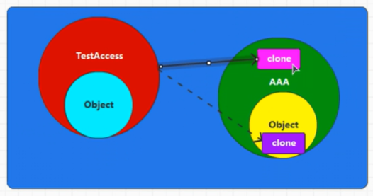
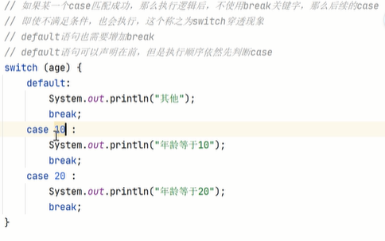
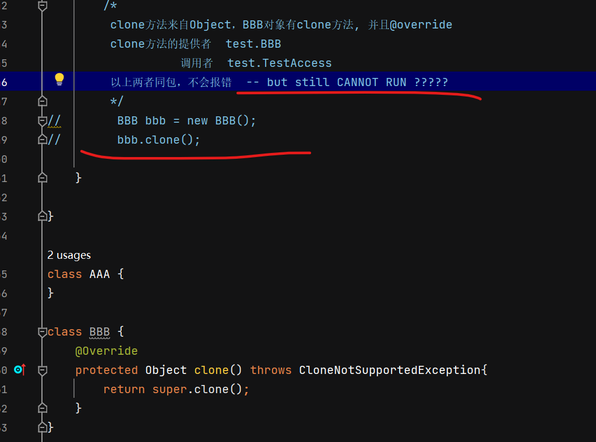

6. 反编译-字节码 [test\Test,Emp,User.class]  
观察：test中对1Emp和User分别调用.age  
- User  age + print messgae (static age)
- Emp  只有 age (static final age)

反编译：  
out/../Emp right-click open-in-terminal   （out是编译后的字节码，src里是源码）  
javap -v User  
javap -v Emp

User 在执行完 static{} 静态方法后， age由0:bipush 赋值

Emp age作为constant直接出现，属于类的一部分；

Test 其实没有调用Emp，直接拿到Emp的值

16. java中访问scala对象  [test\Test.java]  
Scala01_Var.main(args);  

21. 数据类型

30. ==
装箱

45. 方法与函数

结构中，scala和java都用JVM编译 
最后都是.class文件
所以scala要编译成没有函数的文件（反编译码中，函数即为方法）

63. 函数对象为RETURN，多层嵌套 [c05\s06_asRET]

64. 闭包   
若无闭包，压栈，不合理 [c05\s08]
  
闭包示意图: x生命周期延长， 且闭合环境仅仅inner可用

82. java 类

88.Object的继承 

结论：TestAcess不是'AAA的父类Object'的子类，他俩没关系 
clone是成员方法，和对象有关系 
构建AAA对象时，同时构建出OBJECT父类对象（黄色） 
红色TestAccess有自己的OBJECT父类对象（蓝色）  

结论：BBB(AAA)override了clone后，创建了自己的clone 
     TestAccess对象调用同包的BBB对象的方法，不会报错 

93. 为什么object构建对象是单例的 
 
反编译 
public static 类名$ MODULE$; 
static{}静态代码块中，构建当前对象，并赋值给MODULE$ - private  
静态只执行一次，所以只有一个单例对象 

99. scala单继承 
多继承-钻石问题 

107. trait extends在反编译java里如何实现

110. 多个traits的初始化和执行顺序

116. java的集合: 侧重数据间的关系 + 数据结构之间的关系  
 

    /* Scala集合
    scala是面向函数式的语言，学习集合时，更侧重集合本身的功能

    数据结构上，scala的集合分为三大类：
    1. Seq: 存储有序，数据可重复
    2. Set: 存储无序，数据不可重复
    3. Map: 存储无序，KEY不可重复, VALUE可以

    数据处理上，scala的集合分为两大类：
    1. 不可变集合  scala.collection.immutable
    2. 可变集合    scala.collection.mutable
    原始数据： 处理数据时，一般从数据源获取数据，但数据的数据源一般不可以随意改变。
                        如果必须变，也是新建并替换

    String & StringBuilder
    String:        不可变字符串， 类没有提供改变其内容的方法，如果有，也是创建新的并替换旧的
    StringBuilder: 可变字符串，   可以改变自身内容

     */

116. 集合类型/trait关系图 
Iterable  ->  Map, Set, Seq

绿色： trait 
蓝色： class

141. list.sliding()

145. List[String].flatMap, 参数类型：String => GenTraversableOnce  
查看hierarchy快捷键： ctrl+H

163. reduceLeft迭代两两计算

164. reduceLeft / Right迭代两两相减 
错的： 

对的： 

169. 模式匹配 - java switch 

  

下划线的作用 

178. 异常 - java

问题
1. testAcess.java: clone cannot access, tho override

173. 模式匹配 - list
