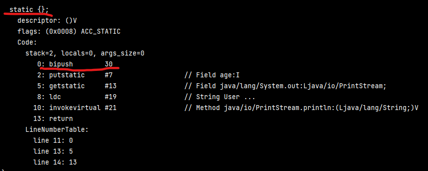

6. 反编译-字节码 [test\Test,Emp,User.class]  
观察：test中对1Emp和User分别调用.age  
- User  age + print messgae (static age)
- Emp  只有 age (static final age)

反编译：  
out/../Emp right-click open-in-terminal   （out是编译后的字节码，src里是源码）  
javap -v User  
javap -v Emp

User 在执行完 static{} 静态方法后， age由0:bipush 赋值

Emp age作为constant直接出现，属于类的一部分；

Test 其实没有调用Emp，直接拿到Emp的值

16. java中访问scala对象  [test\Test.java]  
Scala01_Var.main(args);  

21. 数据类型

30. ==
装箱

45. 方法与函数

结构中，scala和java都用JVM编译 
最后都是.class文件
所以scala要编译成没有函数的文件（反编译码中，函数即为方法）

63. 函数对象为RETURN，多层嵌套 [c05\s06_asRET]

64. 闭包   
若无闭包，压栈，不合理 [c05\s08]
  
闭包示意图: x生命周期延长， 且闭合环境仅仅inner可用

问题
